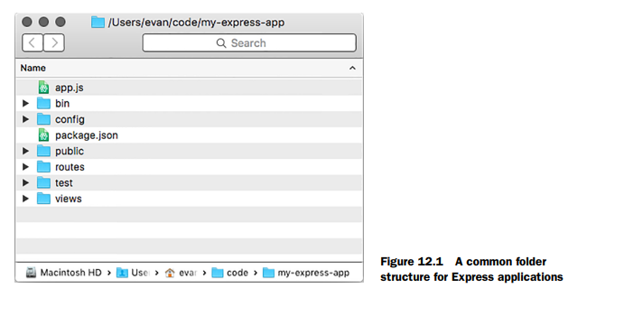

# Express Web Application

This is a small web application used to demonstrate knowledge of Node.js and Express, all files are currently served as in-line html or as static HTML files, with the aim to use EJS in future weeks.

This project is structured based on a simplified version of the example given in Express In Action page 220. As such, router objects can be found in the routes folder and static HTML files in the public folder. This projects index.js is a combination of the examples app.js and bin folder.

## How to run locally

1. Clone the repo
2. Ensure you have Node.js installed locally
3. Install all dependancies with `npm install`
4. Launch the web server with `npm start` or with `npm run keep-running` to run the server with `forever`
